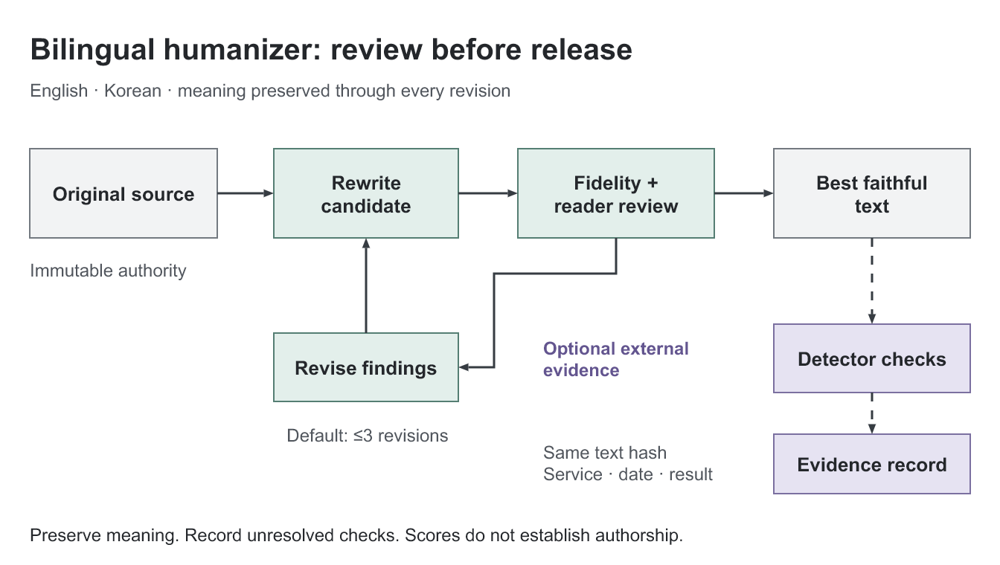
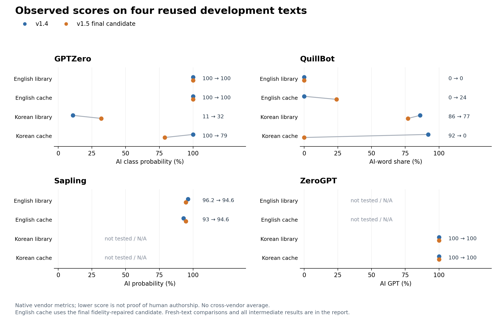
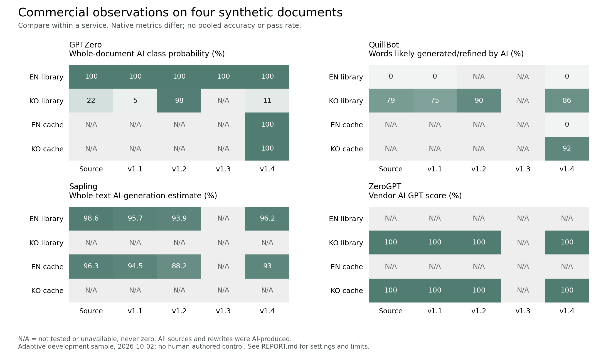

# Bilingual Humanizer

[English](README.md) · [스킬 본문](skills/bilingual-humanizer/SKILL.md) · [실제 검사 기록](benchmarks/2026-10-02/REPORT.md)

한국어와 영어 초안을 독자에게 자연스럽게 읽히도록 다시 쓰는 범용 스킬입니다. 업무·기술·학술 문서, 일반 콘텐츠, 창작 글과 한영 혼용 문서를 지원합니다. 기본 동작은 문장과 문단의 적극적인 재작성입니다. 최소 교정, 검토만 하기, 제공된 글의 문체 맞추기도 가능합니다.



[편집 가능한 PowerPoint](docs/assets/workflow.pptx) · [그림 구도 초안](docs/assets/composition-draft.png) · [도식 검증](docs/figure-evidence/render-review.md). 도식은 요청받은 [paper-figure](https://github.com/JYS1025/paper-figure) 스킬의 전체 이미지 초안 → 네이티브 도형 재구성 → 저장 파일 검증 절차로 만들었습니다. 선택적인 탐지기 피드백을 다음 검토에 반영하는 과정은 스킬 본문에 설명합니다.

## 현재 버전 v1.5.1

이번 버전은 **사실 보존과 결과 판정을 보정한 유지보수 버전**입니다. 서론을 다시 쓸 때 문서의 검토 목적과 결정 단계를 지키도록 명시했습니다. 오프라인 검사기에 엄격한 `gt`/`lt`를 추가해 정확히 50%인 결과가 `Human >50%`를 통과하지 않도록 했습니다.

스킬 저장소 13개와 연구 구현 3개를 추가로 검토하고 두 재작성 실험안을 시험했지만 기본값으로 채택하지 않았습니다. [추가 상용 검사 32건](benchmarks/deeper-trial/REPORT.md)에서 같은 영어 박물관 문서는 GPTZero Human 0%·QuillBot Human-written 100%였고, 한국어 도서관 A안은 60%·11%였습니다. 새 한국어 에세이는 실험 B안에서 GPTZero Human이 42%→2%로 낮아졌습니다. 독립 세션에서 v1.5.1로 새로 작성한 도서관 문서는 GPTZero Human 50%·ZeroGPT AI GPT 100%였으며, QuillBot은 무료 횟수가 소진돼 검사하지 못했습니다. **모든 검사기 Human 50% 초과 목표는 미달입니다.** 두 Human 수치는 정의가 다른 지표이며 저자를 증명하지 않습니다.

[독립 스킬 감사](benchmarks/deeper-trial/final-skill-audit.md)에서는 도서관 글의 사실과 목적 보존을 확인했고 회귀검사 45개 및 별도 경계·단위 확인 10건이 통과했습니다. [최종 증거 감사](benchmarks/deeper-trial/final-evidence-audit.md)는 공개할 기록을 별도로 검토합니다. 모두 독립 문맥의 AI 세션 검토이며 인간 평가는 아닙니다. [추가 자료 검토](skills/bilingual-humanizer/references/further-reference-review.md)에 검토 범위와 채택하지 않은 규칙의 이유를 공개합니다.

## v1.5에서 도입한 재작성 방식

독자·목적·거리감·실제 문체 특징을 먼저 정합니다. 반복 지시를 행위자·행위·대상·시점·강도로 비교하고, 문장의 기능을 실제 주장에 흡수하는 방법을 보강했습니다. 추상적인 한국어 술어와 영어 메타 설명도 문장 전체에서 다시 구성합니다.

단어만 바꾸지 않고 원문의 사실·조건·의견·독자에게 요구하는 행동을 먼저 정리합니다. 이 의미 단위에서 정보 순서를 정하고 문단을 새로 씁니다. 측정값과 직접적인 한계가 멀어지지 않도록 함께 묶고, 같은 사실을 반복하는 검토·안내 지시는 주체와 의무 강도를 유지하면서 정리합니다.

한국어는 조사·서술어·높임·문장 경계를 한국어 문맥에 맞춰 다룹니다. 영어는 독자가 따라갈 대상과 새 정보를 중심으로 문장을 구성합니다. 자연스러워 보이려고 경험을 꾸미거나, 반말·오탈자·숨은 문자·무작위 문장 길이를 넣지 않습니다.

`im-not-ai`도 추가로 조사해 반복되는 대조·당위 결말, 대명사의 지칭 대상, 윤문 중 새로 생기는 상투구와 격식 상승을 문맥에서 점검하도록 보강했습니다. 고정 변경률이나 문장 길이 목표는 적용하지 않습니다.

이 변경은 재작성 방법의 보강입니다. 기본 수정 한도는 3회로 유지합니다. 사실 보존과 독자 관점 검토는 별도로 수행하고, 허용된 독립 세션 검토는 실제 실행 여부를 기록합니다.

## v1.5 실제 결과

**당시 v1.5 유지 결정:** 짧은 독자 중심 지침으로 추가 17건을 검사했지만 새 주제에서는 탐지 결과가 개선되지 않았고, 블라인드 문장 품질 검토도 기존 버전을 조금 더 선호했습니다. [추가 실험과 유지 결정](benchmarks/additional-trial/REPORT.md)에 전체 결과를 공개했습니다. 당시 변경하지 않았던 v1.5 스킬 20개 파일은 실험 기록과 함께 보관했습니다. 현재 v1.5.1의 유지보수 변경은 위에 설명했습니다.

한국어 기술 문서에서 QuillBot AI 92%→0%, GPTZero AI 100%→79%의 개선을 확인했습니다. 그러나 한국어 도서관 글은 GPTZero AI 11%→32%로 악화됐고, 의미를 보정한 영어 기술 문서는 Sapling 93%→94.6%, QuillBot 0%→24%로 악화됐습니다. **여러 탐지기에서 대부분 인간 작성으로 판정된다는 목표는 미달입니다.**

새 원문 두 개의 비교에서도 탐지 성능 개선을 입증하지 못했습니다. 블라인드 모델 검토는 작은 차이로 여섯 사례 중 다섯 사례에서 v1.4를 선호했습니다. [전체 실험 보고서](benchmarks/2026-10-02-v15/REPORT.md)에 개선·악화·추가 작성 방식의 실패와 최종 입력 해시를 모두 공개했습니다. 영어 기술 문서의 Sapling 88.2%는 의미 보정 전 후보의 결과이며 최종본 점수가 아닙니다.



## 설치와 사용

Codex의 기본 skill installer에 다음과 같이 요청할 수 있습니다.

```text
https://github.com/ChihyunAhn0309/bilingual-humanizer 저장소의
skills/bilingual-humanizer 스킬을 설치해줘.
```

직접 설치하려면 해당 폴더를 `$CODEX_HOME/skills/bilingual-humanizer`에 복사합니다. 일반적인 기본 위치는 `~/.codex/skills/bilingual-humanizer`입니다. 기존 설치가 있다면 변경 내용을 확인한 후 교체하세요. 호스트가 자동으로 스킬 목록을 갱신하지 않으면 새 세션에서 사용합니다.

```text
이 문서를 bilingual-humanizer로 다시 써줘.
사실·수치·조건·말투는 지키고 구조와 문장은 적극적으로 바꿔줘.

이 글은 검토만 해줘. 실제로 어색한 부분과 그 이유를 짚어줘.

첨부한 글의 문체를 참고하되, 사실은 수정할 원문에서만 가져와줘.
```

탐지기 검사를 요청하면 실제 사용할 수 있는 서비스나 제공된 결과를 바탕으로 피드백을 반영합니다. 계정·API·유료 이용권은 포함되어 있지 않습니다. 결과는 같은 후보의 해시, 서비스, 모델, 시점과 연결하며 실패·미검사·오래된 결과를 통과로 처리하지 않습니다.

## 검증 결과를 읽는 방법

합성 원문, 고정된 수정본, 실제 상용 검사 결과와 검토 기록을 공개합니다. 모든 시험 글은 AI로 만들었으며, 사람이 쓴 대조군이나 대표성 있는 표본은 없습니다. 독립 세션 검토도 같은 호스트 모델의 별도 문맥 검토입니다. 인간 평가나 다른 모델의 검증으로 부르지 않습니다.

**현재 결과는 모든 탐지기에서 인간 판정을 보장하지 않습니다.** 검사기끼리 결과가 다르고 일부 수정본은 여전히 높은 AI 점수를 받았습니다. 개선되지 않은 결과와 접근 제한도 [시험 보고서](benchmarks/2026-10-02/REPORT.md)에 남깁니다. 탐지기의 확률과 AI로 추정한 단어 비율은 서로 다른 지표이며, 어떤 점수도 실제 저자를 증명하지 않습니다.

오프라인 보조 스크립트의 회귀검사는 다음 명령으로 실행합니다.

```sh
python -m unittest discover -s skills/bilingual-humanizer/evals -p 'test_*.py'
```

이 검사는 숫자·단위 등 보존 검사와 탐지 보고서 일관성 검사입니다. 실제 탐지기를 실행하거나 글의 자연스러움을 자동으로 입증하는 테스트는 아닙니다.

누적 스킬 저장소 32개와 연구 구현 3개를 커밋 단위로 목록화했습니다. 파생 저장소와 러시아어 비교 자료를 포함하며, 큰 파일은 일부만 읽은 경우도 있으므로 독립적인 영·한 방법 35개를 완전 검증했다는 뜻은 아닙니다. [출처와 설계 판단](skills/bilingual-humanizer/references/research-sources.md), [기존 19개 목록](skills/bilingual-humanizer/references/skill-sources.json), [추가 목록과 정확한 검토 범위](skills/bilingual-humanizer/references/further-sources.json)를 확인할 수 있습니다. 새로 작성한 스킬과 예제는 MIT 라이선스이며, 참고한 외부 스킬 소스는 재배포하지 않습니다.



